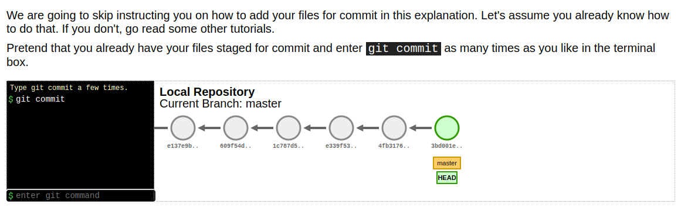
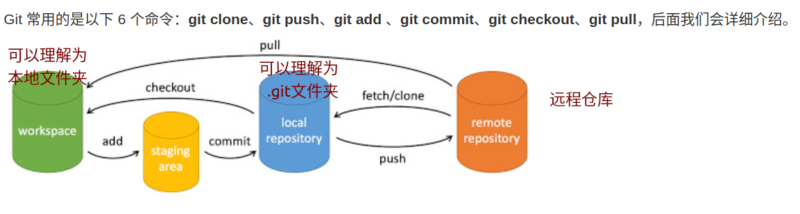
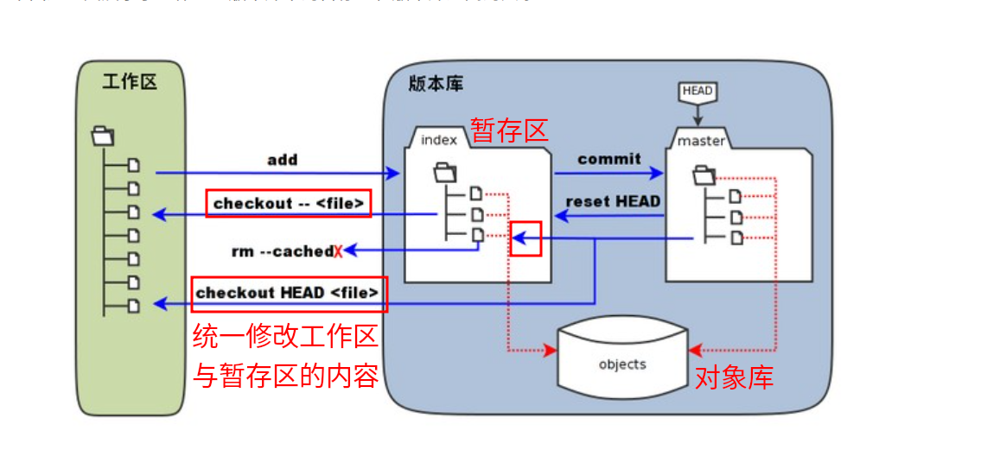
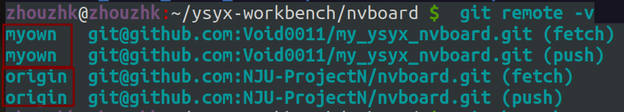

# GIT版本控制

## 基础命令

### init
&emsp;`git init`会在当前目录生成.git文件，在windows中该文件为隐藏文件。在初始化完成后，如果有文件需要加入跟踪，则使用`git add`指令加入跟踪，并采用`git commit`提交。

git init 命令只用于在一个空目录中创建新仓库，不会克隆远程仓库。

### config
&emsp;可以使用该命令配置一些信息，比如用户信息、常用的DIFF工具。

    `--global`用来配置全局的信息，可以理解为之后所有的配置信息均按照上述的信息进行。
如果不想配置全局信息，则去掉`global`指令即可。查看当前的配置信息：
`git config --list`

### log
&emsp;查看存档信息的时候使用，可以加上--oneline参数，这样信息仅显示一行。

### satus
&emsp;查看未跟踪的文件，以及文件状态变化。相对于`git diff`，`satus`只能工作区显示相对于上一次提交更新后的改动，而git diff会显示修改的是什么。

### diff
&emsp;分为三种使用：
对比暂存区和工作区的差别：`git diff [NAME_FILE]`
对比暂存区和上一次提交(commit)的差别：`git diff --cached [NAME_FILE]`
对比两次提交之间的差别：
`git diff [FIRST_BRANCH] [SECOND_BRANCH]`

### add
&emsp;将未跟踪的文件加入跟踪(跟踪的含义是什么？)，添加到暂存区？

### commit

&emsp;当add添加文件结束后，即可进行提交。提交的时候会有一段注释行作为解释本次提交的简介。

注意git commit在图中是逐次向右的，并理解箭头的含义。

## 分支管理
分支管理能够很好地让我们从开发主线上分离到一个分支上，在分支上完成的修改等操作不会改变主线相关内容。

### branch
&emsp;可以通过`git branch`查看当前共有那些分支.
&emsp;通过`git branch NAME`删除NAME分支。

### checkout

#### 基础功能
&emsp;功能：切换分支、切换到某个commit点(存档)中。（每个存档有一个固定的hash code，通过hash code即可切换）
`git checkout NAME_BRANCH`切换分支
`git checkout HASHCODE_COMMIT`读取存档
`git checkout -b NAME_BRANCH`创建新的分支，并切换到新的分支

&emsp;读取存档的时候，有两种方式：一种是直接`git reset`,下文会讲；另一种则是通过上面的hash code,但是如果此时对内容进行了修改，此时不能再通过`git commit`存档了，只能新建一个分支，把修改的部分保存至新的分支。

#### 进阶操作
！！危险指令：
`git checkout .`或者`git checkout -- NAME_FILE`命令用于丢弃当前工作目录中尚未暂存的更改，并将工作目录恢复到与最后一次提交相同的状态。它可以用来撤销对文件的修改，但是要小心使用，因为它会永久性地丢弃未暂存的更改.也就是会用**暂存区**全部或指定的文件替换**工作区**的文件。这个操作很危险，会清除工作区中未添加到暂存区中的改动。

`git reset HEAD` 命令用于取消已经暂存（staged）的更改，将它们重新放回工作目录，从而允许您重新考虑哪些更改应该包括在下一次提交中。这个命令在多种情况下非常有用。但是其会用 HEAD 指向的 master **分支中的全部或者部分文件**替换**暂存区和以及工作区中**的文件。这个命令也是极具危险性的，因为不但会清除工作区中未提交的改动，也会清除暂存区中未提交的改动。

### reset
用于回退版本，可指定返回的版本。共有三个参数，`soft、mixed、hard`.
一般情况，`mixed`参数是默认的，可以不写，用来重置暂存区的内容，保持与上一次提交(commit)一致。工作区内容保持不变。
而`hard`参数要慎重使用，该参数会同时修改工作区和暂存区的内容。
例：
`git reset HEAD^`:回退至上一版本。
`git reset HEAD^^`:回退至上上个版本。
`git reset --hard HASH_CODE`:回退到某个版本之前的所有信息，同时修改本地工作区。

例如修改了两个文件README、hello.php，此时对hello.php进行重置，此时观察需要提交的两个文件状态：

    `
    $ git status -s
    M README
    M hello.php
    $ git add .
    $ git status -s
    M  README
    M  hello.php
    $ git reset HEAD hello.php 
    Unstaged changes after reset:
        M  hello.php
    $ git status -s
    M  README
        M hello.php
    `
可以看到重置之后，hello.php又回到了未add的状态，此时提交只会提交README的修改，但不会提交hello.php。如果想提交hello.php，需要再次add一次。

### 合并操作

当我们需要合并分支的时候，采用`merge`指令。

https://www.runoob.com/git/git-branch.html

以两个分支master、test为例。在master中有两个文件：a.cpp、b.cpp，此时创建一个新的分支test，此时的test分支中同样也有两个文件。当我们切换到test分支，并对b.cpp进行删除操作，新建d.cpp文件。此时切换到master分支，可以发现，并没有出现d.cpp文件，且b.cpp还在。当我们对上述两分支合并后，会发现master分支中b.cpp文件不见了，出现了d.cpp文件。

### 合并冲突
上述合并操作展示了文件的修改与删除，当然我们可能还会涉及到文件的内容更改，此时就会提醒我们发生了冲突，我们需要手动解决该冲突，并采用`git add`告诉文件冲突已解决。

## 远程库

### 创建新的远程库
正常情况下，我们将github的项目clone至我们的电脑后，使用`git remote -v`即可观察得到，现在的远程库关联连接。
比如在ysyx项目中，如下所示：

正常来讲，是只有origin的，如何添加myown呢？上传至自己的远程库？采用下面的指令：
`git remote add [SHORT NAME] [URL]`

### 推送到远程库
推送到远程库：
`git push [ALIAS] [BRANCH]`将自己的BRANCH分支上传至远程库ALIAS中。

### 删除远程库
删除远程仓库：
`git remote rm [SHORT NAME]`

### 抓取远程库代码
如果服务器上更新了，此时要更新到本地分支，分两步操作:
`git fetch [ALIAS]`第二步进行合并分支，也就是将服务器更新的内容合并到当前的分支中去。
`git merge [ALIAS]/[BRANCH]`

如果想一步完成，采用git pull指令

`git pull [远程主机名] [远程分支名]:[本地分支名]`

## 错误记录

### 合并冲突、拉取远程
刚刚将本笔记上传至远程仓库时出现问题，首先在上一级文件夹里进行了`git init`配置，然后进行跟踪和提交`add commit`，随后添加远程仓库连接:`git remote [简称][url]`，最后即可`git push`。

但是`git push`的时候，遇到问题，显示错误：
`error: failed to push some refs to 'github.com:Void0011/Linux_Study_Knowledge.git'`

该错误代表在你尝试推送更改到远程仓库时，但远程仓库中有更新，你的本地仓库没有同步这些更新。需要使用`git pull`拉取远程仓库的更改。

但是使用`git pull`又出现了`Need to specify how to reconcile divergent branches.`错误代表在你尝试推送更改到远程仓库时，但远程仓库中有更新，你的本地仓库没有同步这些更新。解决这个问题的方法是告诉 Git 你要使用哪种合并策略。常见的合并策略有两种：`merge` 和 `rebase`。你可以选择其中一种来合并分支。下面是如何使用这两种策略：
1、使用合并（merge）策略：

使用合并策略将两个分支合并为一个新的提交，这个提交包含了两个分支的更改。执行以下命令：

`git pull origin main --no-rebase`
`--no-rebase`选项告诉 Git 使用合并策略而不是重新基于（rebase）策略。

2、使用重新基于（rebase）策略：

使用重新基于策略将你的本地更改放在远程更改之后，这会使提交历史更加线性。执行以下命令：

`git pull --rebase origin main`
这将拉取远程更改并将你的本地更改重新基于它们。

最后按照流程应该可以push了，但是又显示：
`
    kex_exchange_identification: Connection closed by remote host
    Connection closed by 20.205.243.166 port 22
    fatal: Could not read from remote repository.
    Please make sure you have the correct access rights
    and the repository exists.
`
